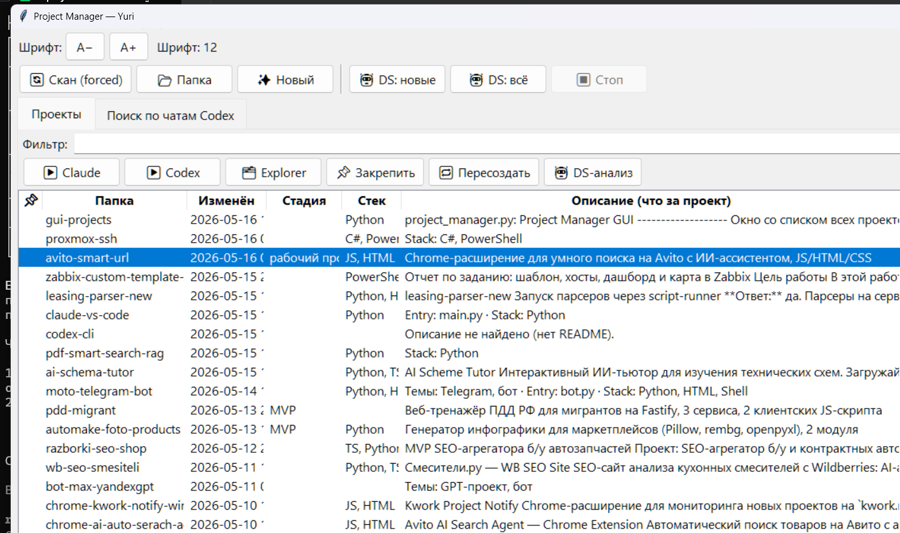

# Project Manager

**🇷🇺 Русский** &nbsp;·&nbsp; [🇬🇧 English](#-english-version)

---

Настольная GUI-программа для тех, у кого папка `Projects` разрослась до сотен подпапок и обычный проводник больше не справляется.

Изначально нужна была одна простая вещь — **быстро запускать любой проект в Claude Code / Codex CLI одним кликом**, без `cd` и копирования путей. Постепенно обросла тем, чего мне не хватало каждый день.

Python 3.10+, Tkinter, Windows 10/11.



## Что умеет

- ▶️ **Запуск Claude Code / Codex CLI в один клик** — открывает Windows Terminal сразу в нужной папке с запущенным агентом.
- 🔍 **Навигация по сотням проектов** — поиск по названию папки и по содержимому `IDEA.md` / `README.md`. Фильтрация в реальном времени.
- 📌 **Закрепление проектов** — то, что сейчас в работе, всегда висит наверху списка.
- 🌅 **Пресеты Windows Terminal** — сохранённые многовкладочные сессии для утреннего рабочего сценария; открывает 5–10 проектов сразу.
- 🎨 **Цветные вкладки** — стабильный хэшированный цвет по имени проекта, чтобы визуально не путать вкладки.
- 🧠 **Авто-описание через DeepSeek** *(опционально)* — по содержимому проекта генерирует короткое описание, стек и стадию (черновик / рабочее / готово). Требует ключ DeepSeek.
- 🌐 **5 языков интерфейса** — RU / EN / DE / ES / 中文, мгновенное переключение без перезапуска. Встроенная справка (F1).
- ♻️ **Восстановление заголовков вкладок** после `/resume` *(в доработке)* — Claude Code сбрасывает имена вкладок через console API, программа их возвращает.
- ✅ **Задачи по проектам** с напоминаниями Windows *(в доработке)* — трекер задач, привязанных к конкретному проекту.

## Установка

```bash
git clone https://github.com/wwwparser/gui-projects.git
cd gui-projects
pip install -r requirements.txt
```

## Настройка

1. Скопируйте шаблон:
   ```bash
   copy .env.example .env
   ```
2. В `.env` укажите **как минимум** `PROJECTS_ROOT` — папку, в которой лежат все ваши проекты.
3. При желании укажите пути к скриптам-обёрткам для Claude / Codex и ключ DeepSeek — программа работает и без них, просто без соответствующих кнопок.

Все параметры описаны в комментариях к `.env.example`.

### Пример скрипта-обёртки Claude

`Claude-BypassProxy.cmd`:
```bat
@echo off
cd /d %1
claude
```

Программа автоматически подхватит и `.cmd`, и `.ps1` с тем же именем — укажите в `.env` любой из двух вариантов.

## Запуск

```bash
python project_manager.py
```

## Сборка в .exe (Windows)

```bash
pip install pyinstaller
pyinstaller ProjectManager.spec
```

Готовый бандл появится в `dist/ProjectManager/`.

## Где программа хранит свои данные

- **Настройки, кэш, задачи, пресеты:** `%APPDATA%\ProjectManager\`
  Отдельно от каталога программы — переустановка / пересборка `.exe` данные не затрагивает.
- **Ежедневные бэкапы:** `Documents\ProjectManager-Backups\<YYYY-MM-DD>\` — хранит 14 последних дней.

## Локализация

Строки интерфейса — в `locales/*.json`. Справка — в `help/*.md`. Чтобы добавить свой язык, создайте одноимённые файлы с новым языковым кодом.

## Ограничения

- Только Windows (используется Windows Terminal + PowerShell для управления вкладками).
- Быстрая навигация рассчитана на структуру «одна корневая папка → плоский или неглубокий список проектов внутри».
- Возможности «Восстановить заголовки» и «Задачи по проектам» доработаны частично — работают, но UX ещё шлифуется.

## Лицензия

MIT — используйте, форкайте, адаптируйте под себя.

---

## 🇬🇧 English version

[⬆ Back to Russian](#project-manager)

A desktop GUI for people whose `Projects` folder has grown to hundreds of subfolders and Windows Explorer no longer cuts it.

The original need was simple — **launch any project in Claude Code / Codex CLI in one click**, without `cd` or copy-pasting paths. Over time it grew everything else I was missing day to day.

Python 3.10+, Tkinter, Windows 10/11.

### Features

- ▶️ **Launch Claude Code / Codex CLI in one click** — opens Windows Terminal directly in the project folder with the agent already running.
- 🔍 **Navigate hundreds of projects** — search by folder name and by `IDEA.md` / `README.md` contents. Real-time filtering.
- 📌 **Pin projects** — whatever you're actively working on stays at the top of the list.
- 🌅 **Windows Terminal presets** — saved multi-tab sessions; open 5–10 projects at once for your morning routine.
- 🎨 **Colored tabs** — stable hashed color per project name, so tabs are visually distinct.
- 🧠 **AI project descriptions via DeepSeek** *(optional)* — auto-generates a short summary, tech stack, and stage (draft / working / done) from project contents. Requires a DeepSeek API key.
- 🌐 **5 UI languages** — RU / EN / DE / ES / 中文, switch instantly without restart. Built-in help (F1).
- ♻️ **Restore tab titles** after `/resume` *(work in progress)* — Claude Code overwrites tab names via the console API; this brings them back.
- ✅ **Per-project task tracker** with Windows notifications *(work in progress)* — tasks bound to a specific project.

### Installation

```bash
git clone https://github.com/wwwparser/gui-projects.git
cd gui-projects
pip install -r requirements.txt
```

### Configuration

1. Copy the template:
   ```bash
   copy .env.example .env
   ```
2. In `.env`, set **at minimum** `PROJECTS_ROOT` — the folder where all your projects live.
3. Optionally, set paths to Claude / Codex wrapper scripts and a DeepSeek API key. The app runs fine without them — those buttons just won't do anything.

All options are documented inline in `.env.example`.

#### Example Claude wrapper script

`Claude-BypassProxy.cmd`:
```bat
@echo off
cd /d %1
claude
```

The app auto-detects both `.cmd` and `.ps1` with the same base name — set either one in `.env`.

### Running

```bash
python project_manager.py
```

### Building an .exe (Windows)

```bash
pip install pyinstaller
pyinstaller ProjectManager.spec
```

The bundle lands in `dist/ProjectManager/`.

### Where data is stored

- **Settings, cache, tasks, presets:** `%APPDATA%\ProjectManager\`
  Kept outside the install directory, so reinstalling / rebuilding the `.exe` won't wipe your data.
- **Daily backups:** `Documents\ProjectManager-Backups\<YYYY-MM-DD>\` — keeps the last 14 days.

### Localization

UI strings live in `locales/*.json`. Help pages live in `help/*.md`. To add a new language, drop a new file with a new language code into both folders.

### Limitations

- Windows only (uses Windows Terminal + PowerShell for tab management).
- Fast navigation assumes a "single root → flat or shallow list of project folders" structure.
- "Restore tab titles" and "Task tracker" are functional but the UX is still being polished.

### License

MIT — use it, fork it, adapt it.
